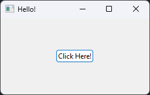

# iupjs

iupjs uses the power of [Bun](https://bun.sh/) FFI to bring native GUI's using the [IUP Toolkit](https://www.tecgraf.puc-rio.br/iup/) for Windows/Linux.<br>Useful for wrapping scripts in a lightweight native toolkit, work with multiple files or even design full blown applications!<br>
# Features
- True native GUI's, no webview, electron or any web based toolkits were used
- Uses standard win32 common controls on windows and GTK on Linux 
- Very simple class system using JavaScript proxies to wrap around native library functions, uses simple attributes to define properties/events (check examples below)
<hr>

# Example
```js
import { button, dialog, fill, hbox, iup, vbox } from "../iupjs/iup";

// Open the IUP toolkit
iup.open()

const btn = new button();
// Assigning properties
btn.title = 'Click Here!';
// Assigning events
btn.action = function() {
    iup.message('Hello!', 'Hello World!');
}

// Passing native objects to other objects
const container = new vbox(
    new fill(),
    new hbox(new fill(), btn, new fill()),
    new fill(),
);

// Defining a window (or dialog in this case)
const dlg = new dialog(container);
dlg.title = 'Hello!';
dlg.size = '180x90';
dlg.show();

// Start the IUP mainloop
iup.mainLoop();
```
Produces the following, clicking the button shows a message.
<div align="center">
    
</div>

# LED Definitions
It's also possible to use the builtin LED file definitions to build UI's, the window above can be done in LED like so
```
btn = BUTTON("Click Here!", do_nothing)

dlg_led = DIALOG[SIZE=180x90, TITLE="Hello!"](
    VBOX(
      FILL(),
      HBOX(
        FILL(),
        btn,
        FILL()
      ),
      FILL()
    )
)
```
And the following JavaScript can be used to load the LED file and interact with the controls
```js
import dialog_led from "./dialog.led" with { type: "file" };
import { button, dialog, iup } from "./iupjs/iup";

iup.open();
await iup.loadLedFromFile(dialog_led);

// Getting a existing control from a loaded LED file
const win = dialog.fromHandleName('dlg_led');
const btn = button.fromHandleName('btn');
btn.title = 'Click Here!';
btn.action = function() {
    iup.message('Hello!', 'Hello World!');
}

win.show()
iup.mainLoop();
```
LED interfaces can be built using IupVled on [Sourceforge](https://sourceforge.net/projects/iup/files/3.31/Tools%20Executables/)<br>
# Documentation
Further documentation about all control types and properties can be found at the [IUP Toolkit website](https://www.tecgraf.puc-rio.br/iup/) (not every control and event type is implemented yet, so check the source code)